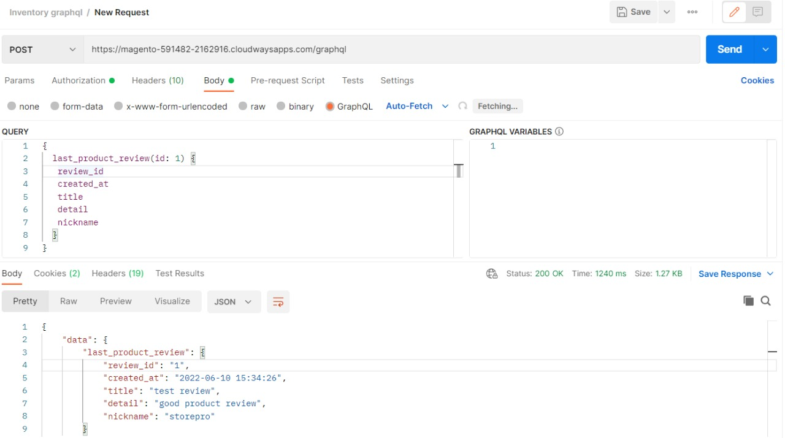
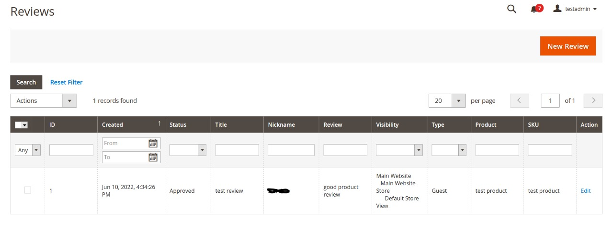

# customgraphql-review
Get a product review details with grapagql using custom module

query /request

{
  last_product_review(id: 1) {
   review_id
   created_at
   title
   detail
   nickname
  }
}

id:1 means your review id number

